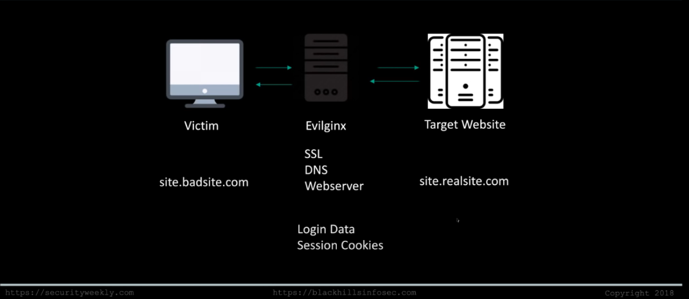
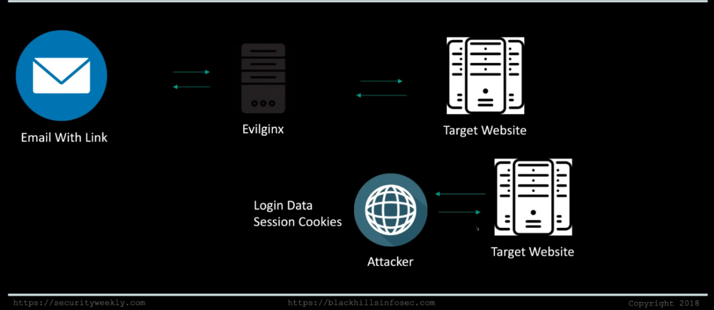

Evilginx2 Man-in-the-Middle Attacks - Tradecraft Security Weekly #29

https://github.com/kgretzky/evilginx2
https://breakdev.org/evilginx-2-next-generation-of-phishing-2fa-tokens/
# What is Evilginx
- Attack Framework
	- Based off initial work with nginx
	- Version 2 is written in Go
	- Very customizable with phishlets
	- Primary purpose is 2FA bypass
	- Capture login and session data

# How does it work?


# Attack Chain


# DEMO
Create a phishlet
```
# sudo evilginx
: phishlets get-url okta https://www.google.com
```
spits out the url for our phishing link
after user visits and pushes the 2FA verification, evilginx will capture all the tokens!
```
: sessions
: sessions 224
```
attacker visits the site 
use a cookie tamper plugin to import the saved json file form nginx and we login
# For the Blue Team:
- Phishing
- DNS Blacklisting