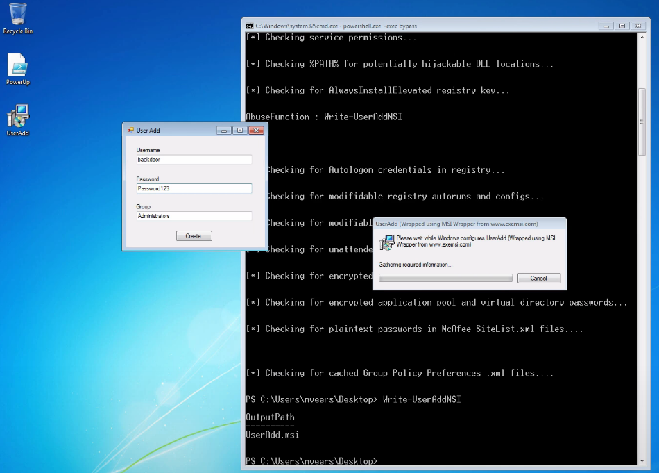

Windows Privilege Escalation (Local) – Tradecraft Security Weekly #2

# Admin Access Should Be Rare
- Standard employees should not have administrative access to their systems
- It's common for remote workers to get admin access of their systems for troubleshooting purposes
- Network admins not only need to worry about provisioning access correctly. They need to worry about privesc vulns
# So what if users are admins?
- Leads to many other attack vectors
- Can extract local password hashes - potential for local admin reuse
- Can perform network level as an admin of the system like LLMNR/NBS poisoning
- Packet capturing localhost
- Can install software 
- Can extract cleartext creds from memory - Mimikatz
# Common PrivEsc Techniques
- Check for missing patches (on the target)
```
C:\> wmic qfe get Caption,Description,HotFixID,InstalledOn
```
- Then check exploit-db
```
# searchsploit MS16 windows local
```
- Browser Creds (enum_ie, enum_chrome, etc..)(Metasploit)
- SessionGopher - find Putty, WinSCP, RDP, cred (FireEye)
- Hot Potato (foxglovesec)
	- NBNS spoof, fake WPAD proxy, HTTP>NTLM Relay
- PowerUp
	- Checks many things including: hijackable DLLs,Unattended install files, modifiable services, unquoted service paths, AlwaysInstallElevated, and more...
# PowerUp
an admin?
```
C:\ net localgroup administrators
C:\ powershell.exe -exec bypass
PS C:> Import-Module .\PowerUp.ps1
PS C:> Invoke-AllChecks
```
found AlwaysInstallElevated vuln
```
PS C:> Write-UserAddMSI
```

may have to modify password to meet complexity requirements
validate that user is created.
```
PS C:> net localgroup administrators
```


